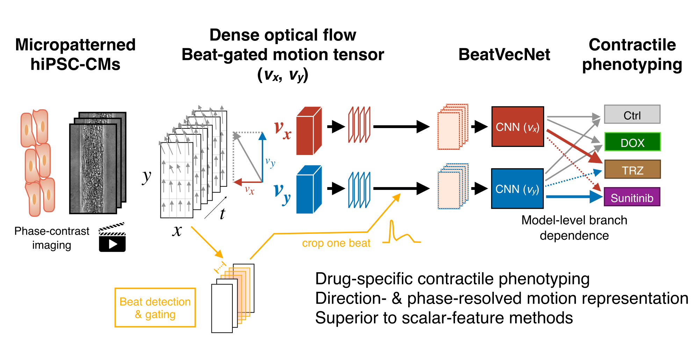

# BeatVecNet

This repository provides the core implementation and executable sample workflow accompanying the BeatVecNet study.

## Accompanying manuscript

**BeatVecNet classifies drug-induced contractile phenotypes from beat-gated motion vectors in micropatterned human iPSC-derived cardiomyocytes**

Shigeyuki Magi, Yasunari Kanda, and Atsuhiko T. Naito

*British Journal of Pharmacology* — manuscript under revision.

# BeatVecNet

BeatVecNet classifies drug-induced contractile phenotypes from beat-gated
motion vectors in micropatterned human iPSC-derived cardiomyocytes.

<p align="center">
  
</p>

## Scope

This repository provides the core implementation of the motion-vector preprocessing and BeatVecNet model architecture used in the study, together with an executable sample training and evaluation workflow and a small sample dataset for code validation.

The public workflow reproduces the principal model architecture, training operations, and hierarchical probability-aggregation procedure described in the paper. The included sample dataset permits end-to-end code validation but is not the complete study dataset and is not intended to reproduce all numerical results, figures, or statistical estimates reported in the paper.

Terminology:
- Videos were recorded at 150 fps.
- Each detected beat is resampled to 150 phase bins per beat on a normalized beat-phase grid.

## Public Sample Workflow

The public sample workflow can train and evaluate BeatVecNet on the sample tensors in `data/sample/`.

It fits channel-wise mean and standard deviation from the sample training split only, saves the fitted sample statistics under the training output directory, stores them in the best checkpoint, and applies the same statistics to validation and test splits. It does not use the final study checkpoint or full-study channel-wise statistics.

The sample workflow saves the best validation-macro-F1 checkpoint as `outputs/sample/best.pt`.

## Reported Study Configuration

`configs/reported_model.yaml` records the main model and training settings reported for the primary BeatVecNet study model. It is a documentation record.

`configs/sample.yaml` is a lightweight executable config for the public sample workflow. These files have different purposes. `configs/reported_model.yaml` is not a drop-in config for regenerating the paper results because the complete study manifests, final trained checkpoint, and fitted full-study channel-wise standardization values are not included.

## Evaluation Scope

The public code includes Beat-to-ROI-to-Well hierarchical probability aggregation:
- Beat to ROI: mean class probabilities across beats within each ROI.
- ROI to Well: mean ROI-level class probabilities across ROIs within each well.
- Well prediction: argmax of the well-level probability vector.

The current sample manifest does not include the real study Well/ROI hierarchy, so the included sample dataset primarily produces sample-level metrics. If a manifest or prediction table with `task_name`, `well_id`, and `roi_id` metadata is provided, well-level evaluation can be run. The sample manifest does not contain artificial hierarchy metadata.

## Not Included

This public package does not include:
- complete study dataset
- final trained checkpoint
- full-study channel-wise standardization values
- full Optuna search history
- all figure-generation and secondary-analysis code
- every reported numerical result

## Dependencies

Python 3.10+ is required.

Install the main training and evaluation dependencies:

```bash
pip install -r requirements.txt
pip install -e .
```

`requirements_preprocess_gpu.txt` contains optional dependencies for GPU/OpenCV preprocessing. Install exactly one CuPy package matching your CUDA runtime if you use that preprocessing path.

## Quickstart

### 1. Environment Setup

```bash
python -m venv .venv
source .venv/bin/activate
pip install -r requirements.txt
pip install -e .
```

### 2. Sample Training

```bash
python scripts/train.py --config configs/sample.yaml
```

This writes:
- `outputs/sample/best.pt`
- `outputs/sample/history.json`
- `outputs/sample/train_summary.json`
- `outputs/sample/sample_training_standardization.json`

The checkpoint contains the sample-training channel means and standard deviations. These are fitted from `split == train` rows in `data/sample/manifest.csv`.

For a short smoke test:

```bash
python scripts/train.py --config configs/sample.yaml --epochs 1
```

### 3. Sample-Level Evaluation

```bash
python scripts/test.py --config configs/sample.yaml --checkpoint outputs/sample/best.pt
```

This writes sample-level predictions, metrics, a confusion matrix, and a classification report under `outputs/sample_eval/`. The test script reads the channel statistics from the checkpoint and will not refit statistics from validation or test data.

### 4. Hierarchical Evaluation

If your prediction CSV contains `task_name`, `well_id`, `roi_id`, `y_true`, and `prob_0` through `prob_3`, run:

```bash
python scripts/evaluate_hierarchical.py \
  --predictions path/to/beat_level_predictions.csv \
  --out-dir outputs/hierarchical_eval \
  --n-classes 4
```

Optional well-level bootstrap macro-F1 confidence intervals can be requested:

```bash
python scripts/evaluate_hierarchical.py \
  --predictions path/to/beat_level_predictions.csv \
  --out-dir outputs/hierarchical_eval \
  --n-classes 4 \
  --bootstrap-resamples 5000 \
  --bootstrap-seed 0
```

The bundled sample manifest lacks hierarchy metadata, so hierarchical evaluation is not run by default for the sample dataset.

### 5. Day 0 Amplitude Normalization

The sample tensors are provided as prebuilt public sample tensors and should not be day 0-normalized again in the quickstart.

For external manifests containing day 0 rows and well identifiers, the reusable utility is:

```bash
python scripts/normalize_by_day0.py \
  --manifest path/to/manifest.csv \
  --repo-root . \
  --out-dir data/processed/day0_normalized \
  --well-col well_id \
  --day-col day \
  --day0-value 0
```

The script writes normalized tensors and a new manifest to the output directory and does not overwrite input tensors.

## Sample Data

The sample dataset is stored under `data/sample/`. See `data/sample/README.md` for the manifest and tensor format.

## License

Source code is licensed under the MIT License in `LICENSE`.

The sample dataset under `data/sample/` is licensed separately under Creative Commons Attribution-NonCommercial 4.0 International, SPDX identifier `CC-BY-NC-4.0`. See `data/sample/LICENSE`.
